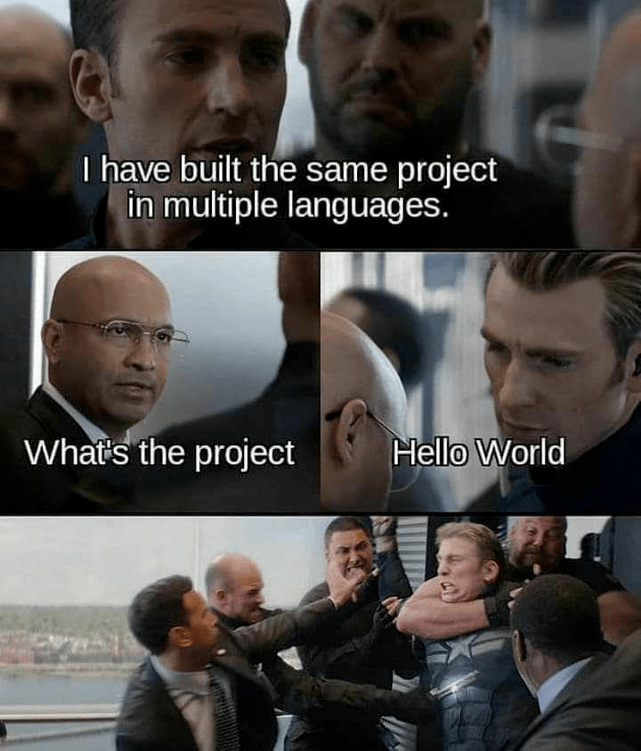

# Hello World

## Welcome



- Algol68
- Bash
- Basic
- Beanshell
- Befunge
- C
- Cobol
- CoffeeScript
- C++
- Crystal
- C#
- D
- Dart
- DogeScript
- Dylan
- Erlang
- Elixir
- Factor
- Fennel
- Fortran
- Gap
- Genie
- Golang
- Groovy
- Haskell
- Java
- JavaScript
- Julia
- Kotlin
- Lisp
- Lua
- Nial
- Nim
- Ocaml
- Pascal
- Perl
- Php
- Powershell
- Python 2
- Python 3
- R
- Racket
- Raku
- Rebol
- Red
- Ruby
- Scala
- Shell
- Smalltalk
- Snobol
- Swift
- TypeScript
- Vala
- Zig
- Zsh

### Requirements
- **docker**
- **docker-compose**

###  To be greeted:
```
docker-compose up --build
```
